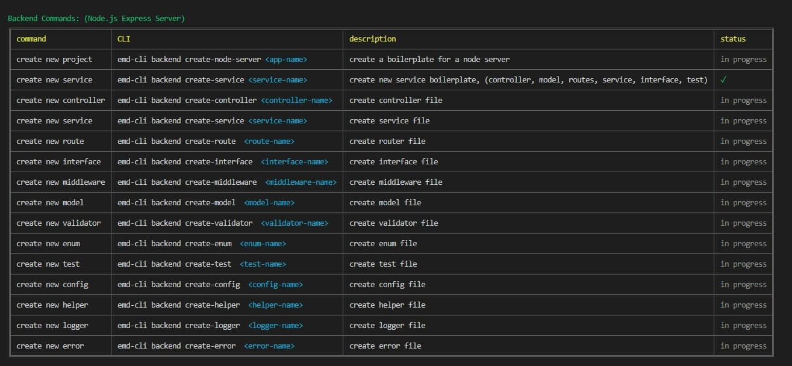
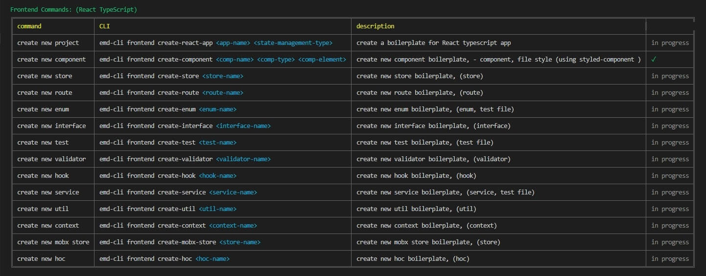

# CLI-Extreme


<br>



## Features - in Simple CLI Command:

### Backend Node.js Express server
- Create a boilerplate for Node.js Express app.
- Creating files in the MVC architecture in the node express application.
- backend server: Creating files in the MVC architecture in the node express application.
  which include: controllers | services | models | views | interfaces | tests | middleware and more...

### Frontend - React TypeScript App 
- Create a boilerplate for React typescript app.
- Creating components with configured styled-component files + unit test files. 
- Creating components such as:
  common | static | pages | animation | templates | utils | layouts.
- Creating hooks react context store | mobx store | service integration and more...

## Installation

```bash    
npm install -g cli-extreme
```

## How to use

### Show all commands: 
```bash    
cli-extreme --help
```
```javascript

Backend Commands: (Node.js Express Server)
╔═══════════════════════╤══════════════════════════════════════════════════════╤═══════════════════════════════════════════════════════╤═════════════╗
║ command               │ CLI                                                  │ description                                           │ status      ║
╟───────────────────────┼──────────────────────────────────────────────────────┼───────────────────────────────────────────────────────┼─────────────╢
║ create new project    │ emd-cli backend create-node-server <app-name>        │ create a boilerplate for a node server                │ in progress ║
╟───────────────────────┼──────────────────────────────────────────────────────┼───────────────────────────────────────────────────────┼─────────────╢
║ create new service    │ emd-cli backend create-service <service-name>        │ create new service boilerplate,                       │ ✓           ║
║                       │                                                      │ (controller, model, routes, service, interface, test) │             ║
╟───────────────────────┼──────────────────────────────────────────────────────┼───────────────────────────────────────────────────────┼─────────────╢
║ create new controller │ emd-cli backend create-controller <controller-name>  │ create controller file                                │ in progress ║
╟───────────────────────┼──────────────────────────────────────────────────────┼───────────────────────────────────────────────────────┼─────────────╢
║ create new service    │ emd-cli backend create-service <service-name>        │ create service file                                   │ in progress ║
╟───────────────────────┼──────────────────────────────────────────────────────┼───────────────────────────────────────────────────────┼─────────────╢
║ create new route      │ emd-cli backend create-route  <route-name>           │ create router file                                    │ in progress ║
╟───────────────────────┼──────────────────────────────────────────────────────┼───────────────────────────────────────────────────────┼─────────────╢
║ create new interface  │ emd-cli backend create-interface  <interface-name>   │ create interface file                                 │ in progress ║
╟───────────────────────┼──────────────────────────────────────────────────────┼───────────────────────────────────────────────────────┼─────────────╢
║ create new middleware │ emd-cli backend create-middleware  <middleware-name> │ create middleware file                                │ in progress ║
╟───────────────────────┼──────────────────────────────────────────────────────┼───────────────────────────────────────────────────────┼─────────────╢
║ create new model      │ emd-cli backend create-model  <model-name>           │ create model file                                     │ in progress ║
╟───────────────────────┼──────────────────────────────────────────────────────┼───────────────────────────────────────────────────────┼─────────────╢
║ create new validator  │ emd-cli backend create-validator  <validator-name>   │ create validator file                                 │ in progress ║
╟───────────────────────┼──────────────────────────────────────────────────────┼───────────────────────────────────────────────────────┼─────────────╢
║ create new enum       │ emd-cli backend create-enum  <enum-name>             │ create enum file                                      │ in progress ║
╟───────────────────────┼──────────────────────────────────────────────────────┼───────────────────────────────────────────────────────┼─────────────╢
║ create new test       │ emd-cli backend create-test  <test-name>             │ create test file                                      │ in progress ║
╟───────────────────────┼──────────────────────────────────────────────────────┼───────────────────────────────────────────────────────┼─────────────╢
║ create new config     │ emd-cli backend create-config  <config-name>         │ create config file                                    │ in progress ║
╟───────────────────────┼──────────────────────────────────────────────────────┼───────────────────────────────────────────────────────┼─────────────╢
║ create new helper     │ emd-cli backend create-helper  <helper-name>         │ create helper file                                    │ in progress ║
╟───────────────────────┼──────────────────────────────────────────────────────┼───────────────────────────────────────────────────────┼─────────────╢
║ create new logger     │ emd-cli backend create-logger  <logger-name>         │ create logger file                                    │ in progress ║
╟───────────────────────┼──────────────────────────────────────────────────────┼───────────────────────────────────────────────────────┼─────────────╢
║ create new error      │ emd-cli backend create-error  <error-name>           │ create error file                                     │ in progress ║
╚═══════════════════════╧══════════════════════════════════════════════════════╧═══════════════════════════════════════════════════════╧═════════════╝


Frontend Commands: (React TypeScript)
╔═══════════════════════╤══════════════════════════════════════════════════════════════════════════╤══════════════════════════════════════════════════════╤═════════════╗
║ command               │ CLI                                                                      │ description                                          │ status      ║
╟───────────────────────┼──────────────────────────────────────────────────────────────────────────┼──────────────────────────────────────────────────────┼─────────────╢
║ create new project    │ emd-cli frontend create-react-app <app-name> <state-management-type>     │ create a boilerplate for React typescript app        │ in progress ║
╟───────────────────────┼──────────────────────────────────────────────────────────────────────────┼──────────────────────────────────────────────────────┼─────────────╢
║ create new component  │ emd-cli frontend create-component <comp-name> <comp-type> <comp-element> │ create new component boilerplate, -                  │ ✓           ║
║                       │                                                                          │ component, file style (using styled-component )      │             ║
╟───────────────────────┼──────────────────────────────────────────────────────────────────────────┼──────────────────────────────────────────────────────┼─────────────╢
║ create new store      │ emd-cli frontend create-store <store-name>                               │ create new store boilerplate, (store)                │ in progress ║
╟───────────────────────┼──────────────────────────────────────────────────────────────────────────┼──────────────────────────────────────────────────────┼─────────────╢
║ create new route      │ emd-cli frontend create-route <route-name>                               │ create new route boilerplate, (route)                │ in progress ║
╟───────────────────────┼──────────────────────────────────────────────────────────────────────────┼──────────────────────────────────────────────────────┼─────────────╢
║ create new enum       │ emd-cli frontend create-enum <enum-name>                                 │ create new enum boilerplate, (enum, test file)       │ in progress ║
╟───────────────────────┼──────────────────────────────────────────────────────────────────────────┼──────────────────────────────────────────────────────┼─────────────╢
║ create new interface  │ emd-cli frontend create-interface <interface-name>                       │ create new interface boilerplate, (interface)        │ in progress ║
╟───────────────────────┼──────────────────────────────────────────────────────────────────────────┼──────────────────────────────────────────────────────┼─────────────╢
║ create new test       │ emd-cli frontend create-test <test-name>                                 │ create new test boilerplate, (test file)             │ in progress ║
╟───────────────────────┼──────────────────────────────────────────────────────────────────────────┼──────────────────────────────────────────────────────┼─────────────╢
║ create new validator  │ emd-cli frontend create-validator <validator-name>                       │ create new validator boilerplate, (validator)        │ in progress ║
╟───────────────────────┼──────────────────────────────────────────────────────────────────────────┼──────────────────────────────────────────────────────┼─────────────╢
║ create new hook       │ emd-cli frontend create-hook <hook-name>                                 │ create new hook boilerplate, (hook)                  │ in progress ║
╟───────────────────────┼──────────────────────────────────────────────────────────────────────────┼──────────────────────────────────────────────────────┼─────────────╢
║ create new service    │ emd-cli frontend create-service <service-name>                           │ create new service boilerplate, (service, test file) │ in progress ║
╟───────────────────────┼──────────────────────────────────────────────────────────────────────────┼──────────────────────────────────────────────────────┼─────────────╢
║ create new util       │ emd-cli frontend create-util <util-name>                                 │ create new util boilerplate, (util)                  │ in progress ║
╟───────────────────────┼──────────────────────────────────────────────────────────────────────────┼──────────────────────────────────────────────────────┼─────────────╢
║ create new context    │ emd-cli frontend create-context <context-name>                           │ create new context boilerplate, (context)            │ in progress ║
╟───────────────────────┼──────────────────────────────────────────────────────────────────────────┼──────────────────────────────────────────────────────┼─────────────╢
║ create new mobx store │ emd-cli frontend create-mobx-store <store-name>                          │ create new mobx store boilerplate, (store)           │ in progress ║
╟───────────────────────┼──────────────────────────────────────────────────────────────────────────┼──────────────────────────────────────────────────────┼─────────────╢
║ create new hoc        │ emd-cli frontend create-hoc <hoc-name>                                   │ create new hoc boilerplate, (hoc)                    │ in progress ║
╚═══════════════════════╧══════════════════════════════════════════════════════════════════════════╧══════════════════════════════════════════════════════╧═════════════╝

```


## License 
MIT License

Copyright (c) 2022 evyatar madari &lt;evyatarmadarri@gmail.com&gt;

Permission is hereby granted, free of charge, to any person obtaining a copy
of this software and associated documentation files (the "Software"), to deal
in the Software without restriction, including without limitation the rights
to use, copy, modify, merge, publish, distribute, sublicense, and/or sell
copies of the Software, and to permit persons to whom the Software is
furnished to do so, subject to the following conditions:

The above copyright notice and this permission notice shall be included in all
copies or substantial portions of the Software.

THE SOFTWARE IS PROVIDED "AS IS", WITHOUT WARRANTY OF ANY KIND, EXPRESS OR
IMPLIED, INCLUDING BUT NOT LIMITED TO THE WARRANTIES OF MERCHANTABILITY,
FITNESS FOR A PARTICULAR PURPOSE AND NONINFRINGEMENT. IN NO EVENT SHALL THE
AUTHORS OR COPYRIGHT HOLDERS BE LIABLE FOR ANY CLAIM, DAMAGES OR OTHER
LIABILITY, WHETHER IN AN ACTION OF CONTRACT, TORT OR OTHERWISE, ARISING FROM,
OUT OF OR IN CONNECTION WITH THE SOFTWARE OR THE USE OR OTHER DEALINGS IN THE
SOFTWARE.

